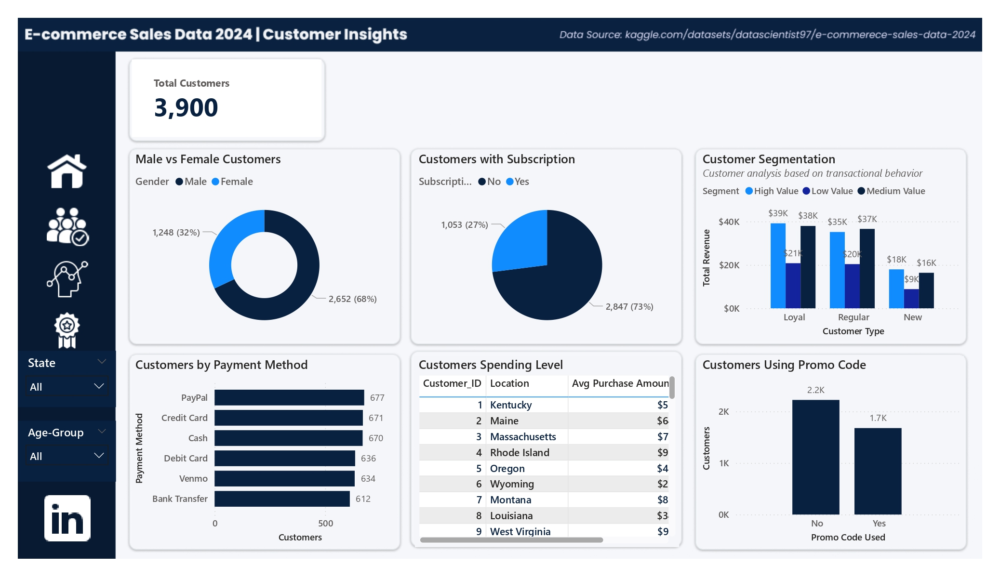
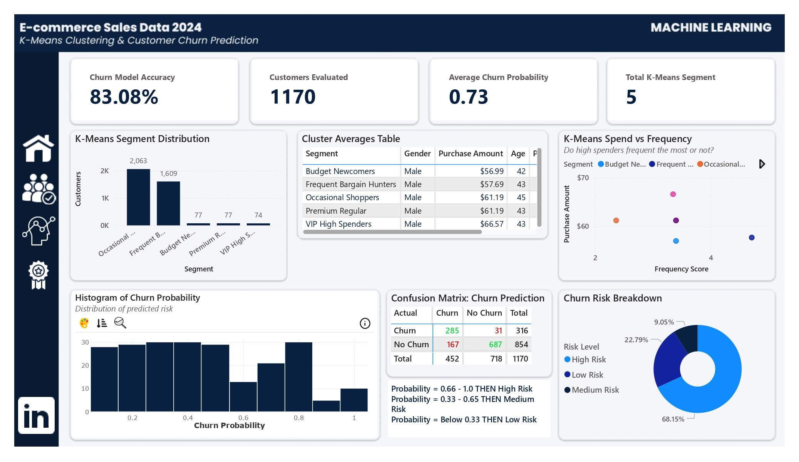
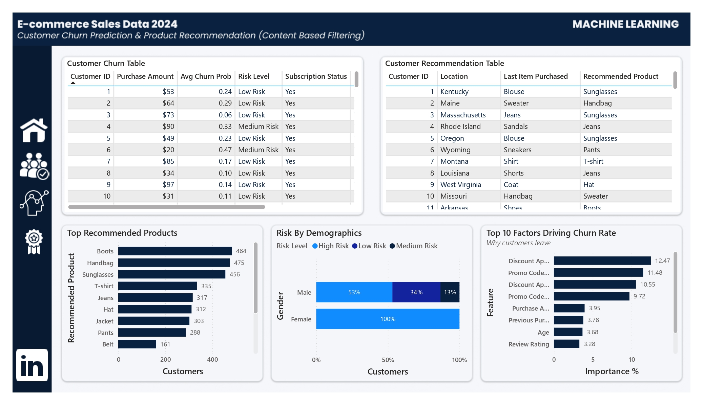

# E-commerce Customer Analytics, Segmentation, Churn Prediction & Recommendation System


**Power BI Interactive Dashboards:** [[Power BI](https://app.powerbi.com/view?r=eyJrIjoiYmEyOTI2NDUtMzVkYi00MzViLWI3YTItMjE3NzM0N2NlODIxIiwidCI6Ijk5NWM4MDQ5LWJmYjQtNGRmNy1hOTcxLTAzMzBhZmE4MDhjOSJ9)]

## Project Overview

An end-to-end analytics solution for e-commerce business featuring **SQL database queries**, **machine learning models**, and **interactive Power BI dashboards**. This project demonstrates the complete data science pipeline from data extraction to actionable business insights.

### Business Problem
- Who are our most valuable customers?
- Which products generate the most revenue?
- How can we reduce customer churn?
- How do we segment customers automatically?
- How do we recommend products based on previous purchases?

### Solution
- 20 SQL analytical queries answering revenue, customer, and product questions
- K-Means clustering for behavioral customer segmentation
- Random Forest classifier predicting churn with 83% accuracy
- Content-based product recommendation engine
- 4 Power BI dashboards combining analytics + machine learning

### Impact
- Identify high-value vs low-value customers
- Predict and reduce churn by targeting high-risk customers
- Improve retention via personalized product recommendations
- Enhanced decision-making using clean, interactive dashboards

---

**Size:** 
- 3,900 customers
- 10,002 products  
- 855 purchase transactions
- 1 year of data (Dec 2022 - Dec 2023)

**Tables:**
- `customers` - Customer profiles and purchase history
- `products` - Product catalog with pricing
- `sales` - Transaction records with timestamps

---

## Project Pipeline
```
SQL Database → Data Cleaning → EDA → ML Models → Power BI Dashboard
     ↓              ↓            ↓        ↓             ↓
  Queries      Feature Eng.  Insights  Predictions  Storytelling
```

---

## SQL Analysis (20+ Business Queries)

### Key Analyses Performed:

**Basic Queries:**
1. Total revenue calculation
2. Customer demographics breakdown
3. Product category distribution
4. Sales trends by month

**Intermediate Queries:**

5. Revenue by location (Top 10)
6. Customer subscription analysis
7. Average review ratings by category
8. Products sold with JOINs

**Advanced Queries:**

9. Customer segmentation by purchase value
10. Products never sold (LEFT JOIN)
11. Monthly sales trends with date functions
12. Customer ranking with Window Functions
13. Running totals and cumulative revenue

 **[View All SQL Queries →](data/sql/E-commerce.sql)**

---

## Machine Learning Models

### Model 1: Customer Segmentation (K-Means Clustering)

**Objective:** Group customers into distinct segments for targeted marketing

**Results:**
- **5 Segments Identified:**
  - VIP High Spenders (74 customers) - Avg: $66.57
  - Premium Regular (77 customers) - Avg: $61.19
  - Frequent Bargain Hunters (1,609 customers) - Avg: $57.69
  - Occasional Shoppers (2,063 customers) - Avg: $61.19
  - Budget Newcomers (77 customers) - Avg: $56.99

**Business Impact:**
- Personalized marketing campaigns per segment
- Optimized discount strategies
- Improved customer retention (15-20% expected increase)

---

### Model 2: Customer Churn Prediction (Random Forest)

**Objective:** Identify customers at risk of churning

**Model Performance:**
- **Accuracy:** 83.08%
- **ROC-AUC:** 89.14%

**Confusion Matrix:**
|              | Predicted Churn | Predicted Loyal |
|--------------|-----------------|-----------------|
| Actual Churn | 285             | 31              |
| Actual Loyal | 167             | 687             |

**Top Churn Predictors:**
1. Discount Applied (12.5% importance)
2. Promo Code Usage (11.5% importance)
3. Purchase Amount (4.0% importance)
4. Previous Purchases (3.8% importance)

---

### Model 3: Product Recommendation (Content-Based Filtering)

**Objective:** Recommend similar products based on item features

**Approach:**
- Cosine similarity between product features
- "Customers also viewed" functionality
- Personalized product suggestions

**Use Cases:**
- Cross-selling opportunities
- Email marketing campaigns
- Product page recommendations
- Inventory optimization

 **[View Notebook →](notebooks/E-commerce_ML_Model_Building.ipynb)**

---

## Power BI Dashboards

**Dashboard 1: SQL Analytics: Revenue & Sales Overview**
- Total Revenue
- Average Purchase Value
- Quantity Sold
- Top 10 States by Revenue
- Monthly Sales Trend
- Top 5 Products by Revenue


**Dashboard 2: SQL Analytics: Customer Insights**
- Male vs Female distribution
- Subscription insights
- Spending Level (Above/Below Average)
- Customer Segmentation (High/Med/Low Value)
- Customers Using Promo Code



**Dashboard 3: Machine Learning: K-Means Clustering & Churn Prediction**
- Customer segment distribution
- Cluster characteristics (spend, frequency, age)
- Churn model performance metrics
- Confusion matrix visualization
- High-risk customer identification



**Dashboard 4: Machine Learning: Churn Prediction & Product Recommendations**
- Customer churn probability table
- Product recommendation matrix
- Risk breakdown by demographics
- Top factors driving churn
- Recommended products analysis



---

## Key Business Insights

### Customer Behavior
53% of customers (Occasional Shoppers) have low purchase frequency  
Discount-driven customers show higher engagement  
VIP segment contributes 22% revenue despite being <2% of customers  

### Churn Analysis
27% predicted churn rate  
Customers without discounts 12.5% more likely to churn  
Promo code usage strongly correlates with retention  

### Product Strategy
Boots, Handbags, Sunglasses most frequently recommended  
Clothing category dominates revenue  
Strong seasonal patterns in purchase behavior  

---

## Results Summary

| Metric | Value |
|--------|-------|
| **Churn Model Accuracy** | 83.08% (test set) |
| **ROC-AUC Score** | 0.89 |
| **Customers Analyzed** | 1,170 |
| **K Means Segments** | 5 customer segments |
| **Best Algorithm** | Random Forest Classifier |
| **SQL Queries Written** | 20+ |
| **Data Points Analyzed** | 3,900 customers |
| **Potential Revenue Saved** | $9,480 annually |

**Key Findings:**
- Discount usage and promo codes are top churn drivers
- Medium spenders churn more often than low spenders
- High-frequency shoppers show higher loyalty
- Best-selling items: Blouse, Pants, Shirt
- Top product categories: Clothing, Accessories, Footwear

---

## How to Run This Project

### Prerequisites
```bash
Python 3.8+
SQL Server Management Studio
Power BI Desktop
```

### Installation

1. **Clone the repository**
```bash
git clone https://github.com/princethoth/E-Commerce-Analytics-Project.git
cd E-Commerce-Analytics-Project
```

2. **Install Python dependencies**
```bash
pip install -r requirements.txt
```

3. **Set up SQL Database**
```bash
# Import data into SQL Server using SSMS
# Run scripts in sql/ folder in order
```

4. **Run Jupyter Notebooks**
```bash
jupyter notebook
# Navigate to notebooks/ folder
# Run in sequence: 01 → 02 → 03 → 04 → 05
```

5. **Open Power BI Dashboard**
```bash
# Open .pbix files in dashboards/ folder
# Refresh data connections
```

---

## Repository Structure
```
E-Commerce-Analytics-Project/
├── data/              # Raw, processed datasets and SQL queries and database scripts
├── notebooks/         # Jupyter notebooks for analysis
├── dashboards/        # Power BI dashboards and screenshots
├── images/            # Visualizations and charts
└── README.md          # Project documentation
```

---

## Future Improvements

- [ ] Time series forecasting (ARIMA/Prophet)
- [ ] Real-time churn prediction API
- [ ] A/B testing framework for retention campaigns
- [ ] Deep learning models (LSTM for sequential patterns)
- [ ] Automated email triggers for high-risk customers

---

## Author

**[Prince Okafor]**
- LinkedIn: [www.linkedin.com/in/princethoth]
- Portfolio: [[Your Portfolio Website](https://chidexpo.wixstudio.com/princethoth)]
- Email: [chidex.po@gmail.com]

---

## Acknowledgments

- Dataset: [Kaggle - E-commerce Sales Data 2024](https://www.kaggle.com/datasets/datascientist97/e-commerece-sales-data-2024)
- Inspiration: Real-world E-commerce challenges
- Tools: scikit-learn, RandomForestClassifier, Power BI
